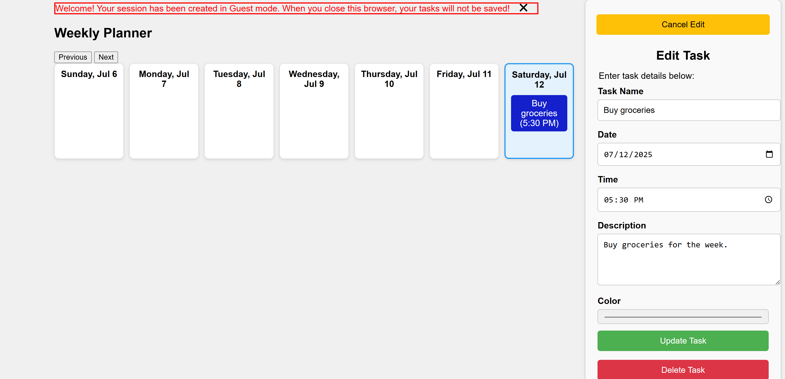

# 🗓️ Weekly Planner

A web-based Weekly Planner application to visually organize and manage tasks using a color-coded weekly grid. Designed to be fast and intuitive.

## 💡 Motivation

This project was created as a personal productivity tool and a portfolio piece to demonstrate full-stack Java web development skills. It also served as a way to explore lightweight web frameworks like **Javalin**, ORM solutions like **Hibernate**, and modern cloud deployment workflows.

## ⚙️ Tech Stack

<table>
  <tr>
    <th>Layer</th>
    <th>Technology</th>
    <th>Rationale</th>
  </tr>
  <tr>
    <td><strong>Backend</strong></td>
    <td>Java + Javalin</td>
    <td>Lightweight, modern web framework with minimal setup and fast routing capabilities</td>
  </tr>
  <tr>
    <td><strong>ORM</strong></td>
    <td>Hibernate</td>
    <td>Abstracts SQL queries and simplifies database interactions via object mapping</td>
  </tr>
  <tr>
    <td><strong>Database</strong></td>
    <td>MySQL</td>
    <td>Popular, reliable open-source relational database</td>
  </tr>
  <tr>
    <td><strong>Frontend</strong></td>
    <td>HTML, CSS, JS</td>
    <td>Clean, flexible static frontend suitable for a lightweight SPA</td>
  </tr>
  <tr>
    <td><strong>Deployment</strong></td>
    <td>Railway</td>
    <td>Easy to use with free-tier support for both web apps and databases</td>
  </tr>
</table>

## ✨ Features

- Week view calendar with hourly time slots  
- Create, update, and delete tasks  
- Color-coded tasks for easy visual parsing  
- MySQL database-backed persistence  
- Responsive frontend with a static file serving setup  

## 🚀 Getting Started

### Prerequisites

- Java 14+
- Maven
- MySQL Server (local or remote)

### Setup

1. Clone the repo

2. Configure your `application.properties` file
   
3. Build and run the application:

   ```
   mvn clean install
   ```

4. Open your browser at `http://localhost:7000`

## 📸 Screenshots

##### Weekly View


## 🌐 Deployment

The [application](https://weekly-planner-production-8071.up.railway.app/) is deployed on **Railway** but it can be deployed on any platform supporting Java and MySQL. Environment variables and production-ready configs can be added as needed.

## 🧩 Planned Improvements

- Google Sign-In support for secure user authentication  
- Task categories and labels  
- Recurring tasks  
- Notifications and reminders  
- Export to calendar (ICS format)

## 🤝 Contributing

Contributions are welcome! To contribute:

1. Fork the repo  
2. Create a feature branch (`git checkout -b feature-name`)  
3. Commit your changes  
4. Push and open a Pull Request

## 📄 License

This project is licensed under the GNU General Public License Version 3. See [`LICENSE`](LICENSE) for details.
